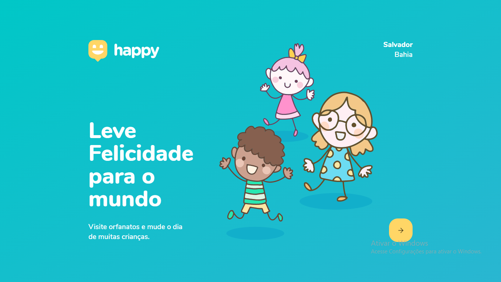

<h1 align="center">
    
</h1>

# Next-Level-Week-Happy

## Projeto

O Happy é uma aplicação que conecta pessoas à casas de acolhimento institucional para fazer o dia de muitas crianças mais feliz.

## Justificativa 

Esté projeto fez parte de um desafio desenvolvido durante a semana da terceira edição do Next Level Week, um evento educacional e gratuito voltado ao desenvolvimento de software,
organizado pela RockeSeat.       

## Tecnologias

Esse projeto foi desenvolvido com as seguintes tecnologias:

- [Node.js](https://nodejs.org/en/)
- [React](https://reactjs.org)
- [TypeScript](https://www.typescriptlang.org/)

## Licença

Esse projeto está sob a licença MIT. Veja o arquivo [LICENSE](LICENSE.md) para mais detalhes.

